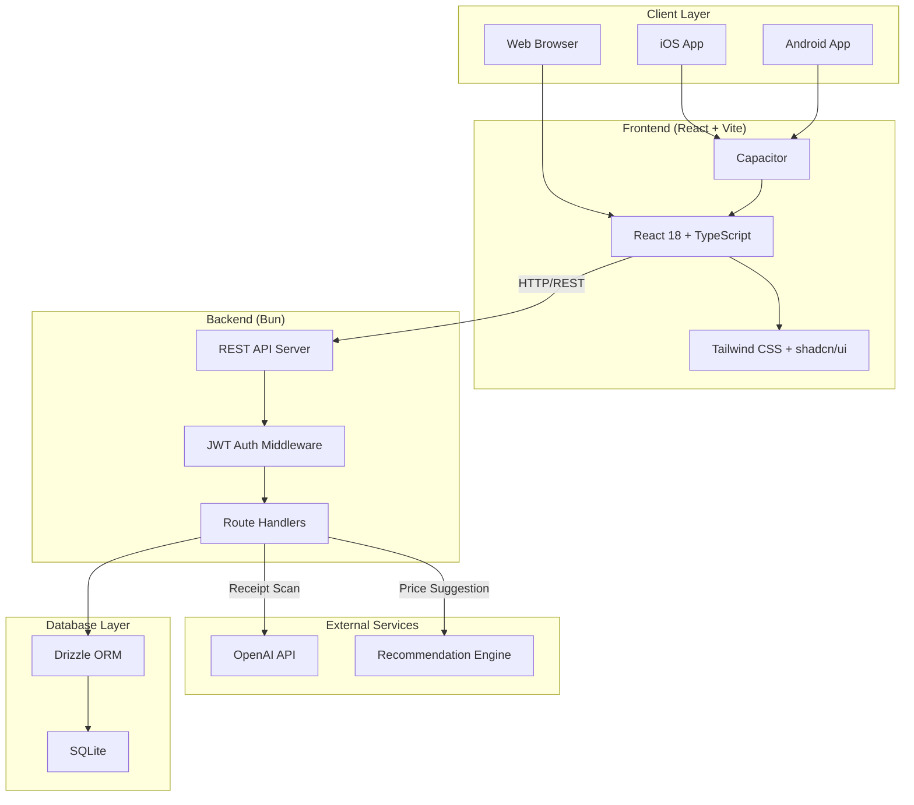
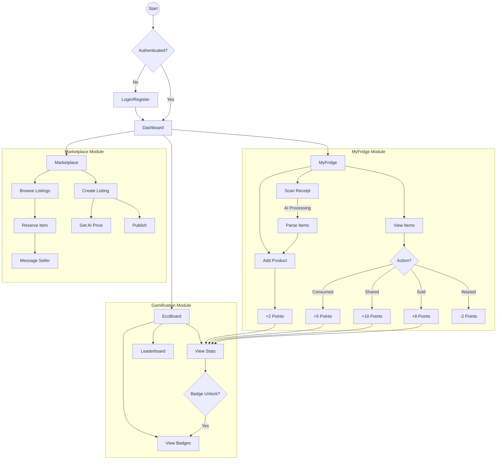
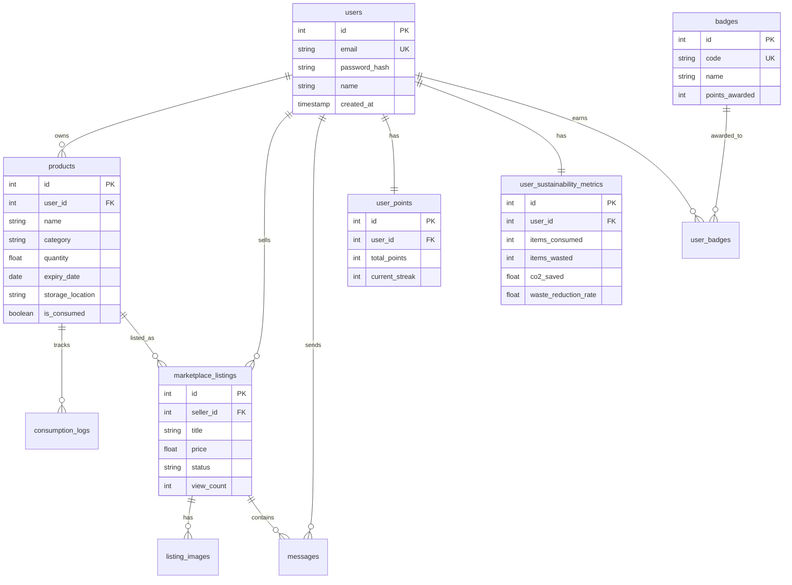
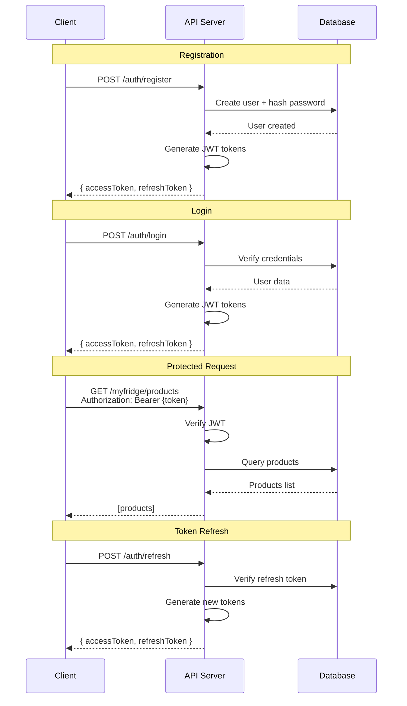
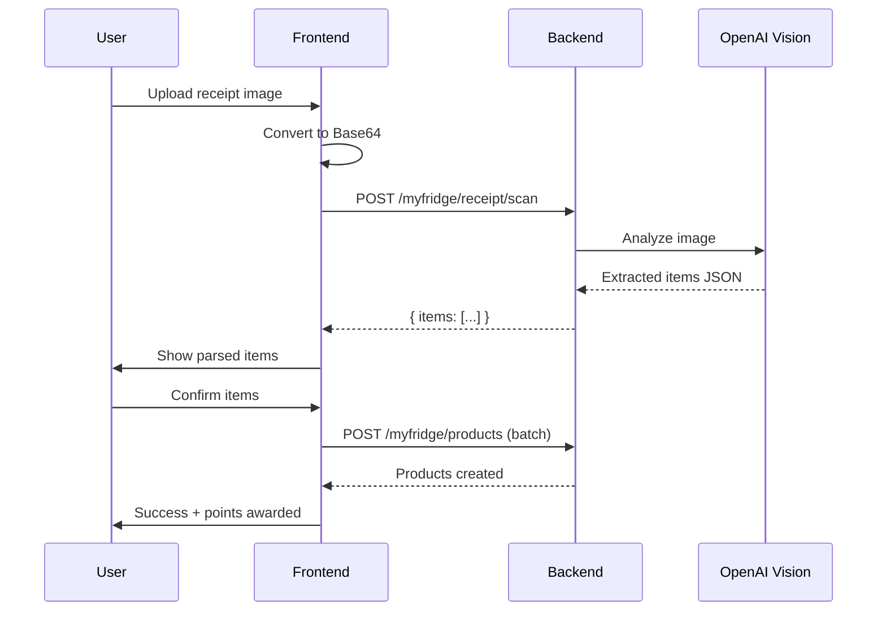

# EcoPlate

A sustainability-focused food management platform that helps reduce food waste through smart inventory tracking, community marketplace, and gamification.

## System Architecture



## Features

### MyFridge
- Track food items with expiry dates
- Receive expiry warnings and notifications
- Scan grocery receipts with AI (OpenAI Vision)
- Log consumption, sharing, and waste

### Marketplace
- List near-expiry food items for sale or free
- Browse and reserve listings from others
- AI-powered price recommendations
- In-app messaging between buyers and sellers

### Gamification (EcoBoard)
- Earn points for sustainable actions
- Track streaks and sustainability metrics
- Unlock badges for achievements
- View CO2 savings and waste reduction rate
- Community leaderboard

## User Flow



## Database Schema



## Tech Stack

| Layer | Technology |
|-------|------------|
| Runtime | [Bun](https://bun.sh) |
| Database | SQLite (via `bun:sqlite`) |
| ORM | [Drizzle ORM](https://orm.drizzle.team) |
| Backend | Bun native HTTP server |
| Frontend | React 18 + TypeScript |
| Build Tool | [Vite](https://vitejs.dev) |
| Styling | [Tailwind CSS](https://tailwindcss.com) + [shadcn/ui](https://ui.shadcn.com) |
| Mobile | [Capacitor](https://capacitorjs.com) (iOS & Android) |
| Auth | JWT (jose library) |
| Validation | [Zod](https://zod.dev) |

## API Authentication Flow



## Receipt Scanning Flow



## Project Structure

```
├── backend/
│   ├── src/
│   │   ├── index.ts           # Main server entry
│   │   ├── routes/            # API route handlers
│   │   │   ├── auth.ts        # Authentication endpoints
│   │   │   ├── myfridge.ts    # Fridge management endpoints
│   │   │   ├── marketplace.ts # Marketplace endpoints
│   │   │   └── gamification.ts# Gamification endpoints
│   │   ├── middleware/        # Auth middleware
│   │   ├── db/
│   │   │   ├── schema.ts      # Drizzle ORM schema
│   │   │   ├── migrations/    # Database migrations
│   │   │   └── seed.ts        # Seed data
│   │   └── utils/             # Utilities
│   ├── public/                # Built frontend assets
│   └── package.json
├── frontend/
│   ├── src/
│   │   ├── components/        # React components
│   │   ├── pages/             # Page components
│   │   ├── contexts/          # React contexts
│   │   ├── services/          # API client + Capacitor utils
│   │   ├── hooks/             # Custom hooks
│   │   └── lib/               # Utilities
│   ├── ios/                   # iOS native project (after cap add)
│   ├── android/               # Android native project (after cap add)
│   ├── capacitor.config.ts    # Capacitor configuration
│   ├── vite.config.ts
│   └── package.json
├── scripts/                   # Start/stop/build scripts
├── package.json               # Root workspace
└── .env.example               # Environment template
```

## Prerequisites

- [Bun](https://bun.sh) v1.0 or higher

## Quick Start

### Using Scripts

**Windows (PowerShell):**
```powershell
# Start both frontend and backend
.\scripts\start-all.ps1

# Stop all servers
.\scripts\stop-all.ps1
```

**Mac/Linux:**
```bash
# Start both frontend and backend
./scripts/start-all.sh

# Stop all servers
./scripts/stop-all.sh
```

### Manual Setup

1. **Install dependencies:**
   ```bash
   bun install
   ```

2. **Set up environment:**
   ```bash
   cp .env.example .env
   # Edit .env with your settings
   ```

3. **Run database migrations:**
   ```bash
   bun run db:migrate
   bun run db:seed
   ```

4. **Start development servers:**
   ```bash
   # Terminal 1: Backend
   bun run dev:backend

   # Terminal 2: Frontend
   bun run dev:frontend
   ```

5. **Open the app:**
   - Frontend: http://localhost:5173
   - Backend API: http://localhost:3000

## Production Build

**Windows:**
```powershell
.\scripts\build.ps1
```

**Mac/Linux:**
```bash
./scripts/build.sh
```

Then start the production server:
```bash
cd backend
bun run src/index.ts
```

The server will serve both the API and the built frontend on http://localhost:3000.

## Mobile Apps (iOS & Android)

The app uses [Capacitor](https://capacitorjs.com) to build native iOS and Android apps.

### Prerequisites

- **iOS**: macOS with Xcode 14+ and CocoaPods
- **Android**: Android Studio with SDK 33+

### Building for Android

**Windows/Mac/Linux:**
```bash
./scripts/build-android.sh
# or on Windows:
.\scripts\build-android.ps1
```

Then open in Android Studio:
```bash
cd frontend && bunx cap open android
```

Or build APK from command line:
```bash
cd frontend/android && ./gradlew assembleDebug
```

APK location: `frontend/android/app/build/outputs/apk/debug/app-debug.apk`

### Building for iOS (macOS only)

```bash
./scripts/build-ios.sh
```

Then open in Xcode:
```bash
cd frontend && bunx cap open ios
```

Or open directly: `frontend/ios/App/App.xcworkspace`

### Mobile Configuration

Edit `frontend/.env.mobile` to set the production API URL:
```
VITE_API_URL=https://api.ecoplate.app/api/v1
```

For development, the app connects to `localhost`. For production builds, update the API URL and rebuild.

### Capacitor Commands

```bash
cd frontend

# Sync web assets to native projects
bun run cap:sync

# Open native IDE
bun run cap:open:ios      # Opens Xcode
bun run cap:open:android  # Opens Android Studio

# Build for mobile
bun run build:mobile      # Build and sync both platforms
bun run build:ios         # Build and copy to iOS
bun run build:android     # Build and copy to Android
```

## Environment Variables

| Variable | Description | Required |
|----------|-------------|----------|
| `PORT` | Server port (default: 3000) | No |
| `JWT_SECRET` | Secret key for JWT signing | Yes (for production) |
| `OPENAI_API_KEY` | OpenAI API key for receipt scanning | No |

## API Endpoints

### Authentication
| Method | Endpoint | Description |
|--------|----------|-------------|
| POST | `/api/v1/auth/register` | Register new user |
| POST | `/api/v1/auth/login` | Login |
| POST | `/api/v1/auth/refresh` | Refresh access token |
| POST | `/api/v1/auth/logout` | Logout |

### MyFridge
| Method | Endpoint | Description |
|--------|----------|-------------|
| GET | `/api/v1/myfridge/products` | List all products |
| POST | `/api/v1/myfridge/products` | Add product |
| GET | `/api/v1/myfridge/products/:id` | Get product |
| PATCH | `/api/v1/myfridge/products/:id` | Update product |
| DELETE | `/api/v1/myfridge/products/:id` | Delete product |
| POST | `/api/v1/myfridge/products/:id/consume` | Log consumption |
| POST | `/api/v1/myfridge/receipt/scan` | Scan receipt (AI) |

### Marketplace
| Method | Endpoint | Description |
|--------|----------|-------------|
| GET | `/api/v1/marketplace/listings` | Browse listings |
| POST | `/api/v1/marketplace/listings` | Create listing |
| GET | `/api/v1/marketplace/listings/:id` | Get listing |
| PATCH | `/api/v1/marketplace/listings/:id` | Update listing |
| DELETE | `/api/v1/marketplace/listings/:id` | Delete listing |
| POST | `/api/v1/marketplace/listings/:id/reserve` | Reserve listing |
| POST | `/api/v1/marketplace/listings/:id/sold` | Mark as sold |
| POST | `/api/v1/marketplace/listings/:id/price-recommendation` | Get AI price suggestion |
| GET | `/api/v1/marketplace/listings/:id/messages` | Get messages |
| POST | `/api/v1/marketplace/listings/:id/messages` | Send message |
| GET | `/api/v1/marketplace/messages` | Get all conversations |

### Gamification
| Method | Endpoint | Description |
|--------|----------|-------------|
| GET | `/api/v1/gamification/dashboard` | Get dashboard data |
| GET | `/api/v1/gamification/points` | Get points details |
| GET | `/api/v1/gamification/badges` | Get all badges |
| GET | `/api/v1/gamification/metrics` | Get sustainability metrics |
| GET | `/api/v1/gamification/leaderboard` | Get leaderboard |

## Scripts Reference

| Script | Description |
|--------|-------------|
| `start-backend.ps1` / `.sh` | Start backend server with dependencies |
| `stop-backend.ps1` / `.sh` | Stop backend server |
| `start-frontend.ps1` / `.sh` | Start frontend dev server with dependencies |
| `stop-frontend.ps1` / `.sh` | Stop frontend dev server |
| `start-all.ps1` / `.sh` | Start all servers (backend, frontend, recommendation) |
| `stop-all.ps1` / `.sh` | Stop all servers |
| `build.ps1` / `.sh` | Build web app for production |
| `build-android.ps1` / `.sh` | Build Android app |
| `build-ios.sh` | Build iOS app (macOS only) |

## Database

The application uses SQLite stored at `backend/ecoplate.db`. The schema includes:

- **Users & Auth**: users, refresh_tokens, password_reset_tokens
- **MyFridge**: products, receipt_scans, consumption_logs
- **Marketplace**: marketplace_listings, listing_images, messages
- **Gamification**: user_points, point_transactions, badges, user_badges, user_sustainability_metrics, daily_sustainability_snapshots

## License

MIT
